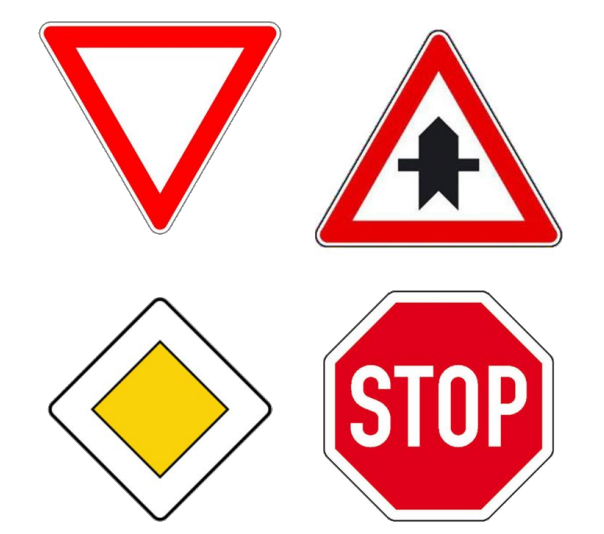
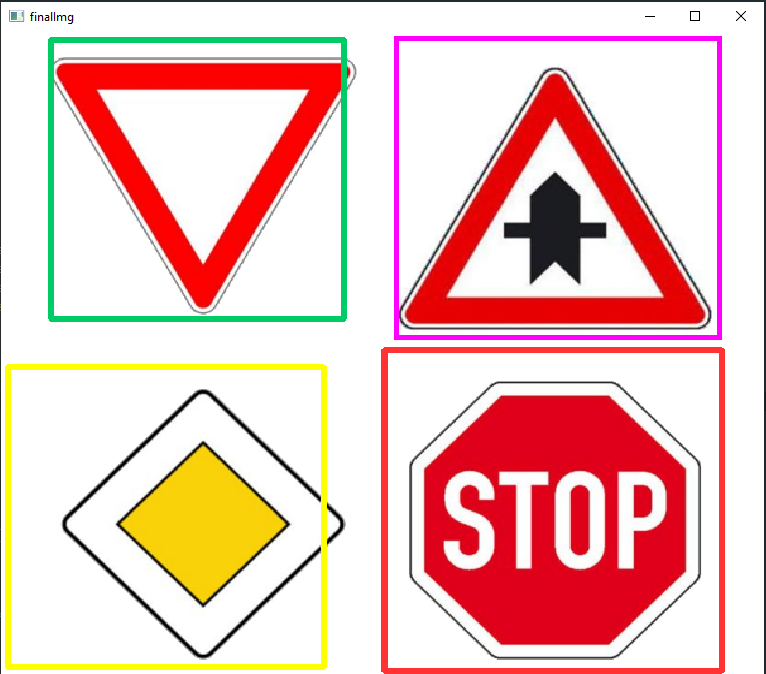

# Cascade-Classifier Roadsign Detection

<p>This project is using the OpenCV Cascade Classifier to run a roadsign detection. 
The models were trained with the the OpenCV methods. For further information check the OpenCV Documentation.</p>

<p>The following signs will be detected:

</p>


## Prerequisites
To run the script you will need Python 3.7. Additionally the libarys <strong>OpenCV</strong> and <strong>Numpy</strong> have to be installed.
## Running the script
To run a detection of a picture run the script cascade.py. Computing may take some seconds depending on your setup.


```shell
image_path="path_to_image"


python cascade.py image_path
```


## Result

The result will be displayed in a new window, which will be opened automatically and closed by pressing any key.

<p>For interpreting the colors of the image refer to the following picture:

</p>

Detections may be false. This could be resolved with further training.
